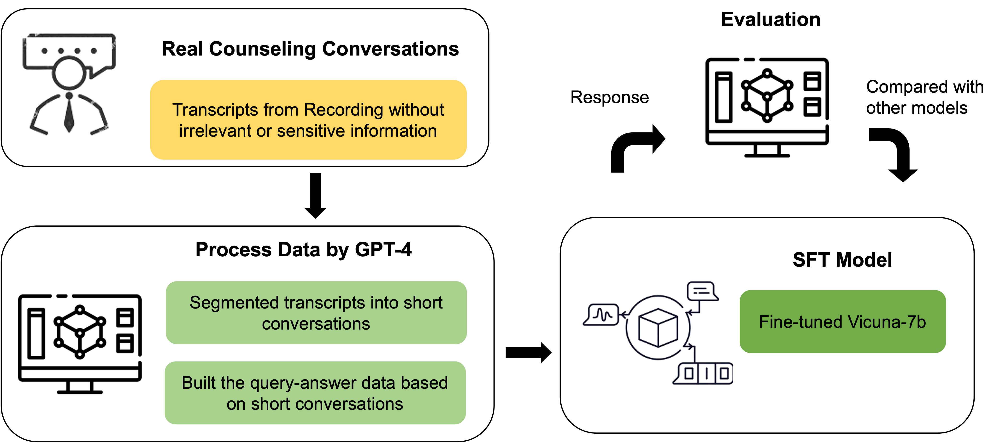

# ChatPsychiatrist
<div align="center">
  <a href="https://github.com/EmoCareAI/ChatPsychiatrist">
    
  </a>
  
</div>

<div align="center">
  <figure>
    
    <figcaption>Comparison of dialogues between user and chatbot on Stress topic. Left: ChatPsychiatrist. Right: ChatGPT.</figcaption>
  </figure>
</div>


[](LICENSE)
[](https://arxiv.org/abs/2309.15461)

Introducing our project, the **ChatPsychiatrist**—a transformative solution in the field of mental health support. We aim to address the delays in traditional psychiatric and counseling services by providing early-stage assistance and effective interventions. Utilizing LLMs, the ChatPsychiatrist swiftly identifies individual issues and offers tailored treatment recommendations. With an adaptive communication style, it becomes a powerful and free tool to provide personalized mental health support to users in need.

This repo open-sources the Instruct-tuned LLaMA-7B model that has been fine-tuned with counseling domian instruction data. To construct our 8K size instruct-tuning dataset, we collected real-world counseling dialogue examples and employed GPT-4 as an extractor and filter. In addition, we have introduced a comprehensive set of metrics, specifically tailored to the LLM+Counseling domain, by incorporating counseling domain evaluation criteria. These metrics enable the assessment of performance in generating language content that involves multi-dimensional counseling skills. The brief pipeline is shown below:
<div align="center">
  <figure>
    
  </figure>
</div>

# Updates
- [2024-3-12] Our Psych8k dataset can be accessed through [huggingface](https://huggingface.co/datasets/EmoCareAI/Psych8k)
- [2023-9-26] Our paper ["ChatCounselor: A Large Language Models for Mental Health Support"](https://arxiv.org/abs/2309.15461) has been accepted by PGAI CIKM 2023.
- [2023-7-28] First release of ChatPsychiatrist. We open-source the Instruct-tuned LLaMA-7B model that has been fine-tuned with counseling domian instruction data.

# Quick Start
## ⚙️ Install
Our repo mainly constructed based on [FastChat](https://github.com/lm-sys/FastChat/tree/main). Please follow the [install instructions](https://github.com/lm-sys/FastChat/tree/main). Or you can install from source by
```bash
git clone https://github.com/EmoCareAI/ChatPsychiatrist.git
cd ChatPsychiatrist
pip3 install -r requirements.txt
```

## ⏬ Model Download
We provide the weights hold on [Huggingface](https://huggingface.co/EmoCareAI/ChatPsychiatrist). You can download the model weights using [Huggingface Client Library](https://huggingface.co/docs/hub/models-downloading#using-the-hugging-face-client-library). Or use the following wget script:
```bash
mkdir -P PATH_TO_WEIGHTS_DIR && cd PATH_TO_WEIGHTS_DIR
user='EmoCareAI'
repo='ChatPsychiatrist'
curl "https://huggingface.co/${user}/${repo}/tree/main" | grep -o 'href="[^"]*"' | cut -d'"' -f2 | grep "^/${user}/${repo}/blob/main/" | sed "s|^|https://huggingface.co|; s|/blob/|/resolve/|g" > files.txt && wget -nc -i files.txt && rm files.txt
cd ..
```


## 🚀 Inference
#### Inference with CLI
See details refer to [FastChat CLI Inference](https://github.com/lm-sys/FastChat/tree/main#inference-with-command-line-interface). In short, you can run the following command below around 14GB of GPU memory.
```bash
# Single GPU inference
python3 -m fastchat.serve.cli --model-path PATH_TO_WEIGHTS_DIR
# Multi GPUs inference
python3 -m fastchat.serve.cli --model-path PATH_TO_WEIGHTS_DIR --num-gpus N
```

#### Serving with Web GUI
1. Launch the controller, which manages the distributed workers
```bash
python3 -m fastchat.serve.controller
```
2. Launch the model worker. 
```bash
python3 -m fastchat.serve.model_worker --model-path PATH_TO_WEIGHTS_DIR
```
3. Launch the Gradio web server
```bash
python3 -m fastchat.serve.gradio_web_server
```
See details refer to [FastChat Web GUI Serving](https://github.com/lm-sys/FastChat/tree/main#serving-with-web-gui)


# Data
### Data Source

The data used for this project comes from ~260 real conversations in counseling recordings (in English). The transcripts of these recordings were used as the primary source for building the training and testing datasets. These conversations cover a variety of topics, including *emotion*, *family*, *relationship*, *career development*, *academic stress*, etc. This figure below shows the distribution of mental health-related topics in Psych8K. (The inner circle represents 5 major categories, and the outer group represents minor topics)

<div align="center">
    <figure>
        
    </figure>
</div>


### Data Processing

To build the dataset, we took the following steps:

1. **Transcription:** The counseling recordings were transcribed to obtain the raw textual data.

2. **Data Cleaning & Information Extraction:** The transcripts were cleaned to remove any irrelevant or sensitive information, ensuring that the data used for training and testing maintains privacy and ethical standards. Since single round conversations in real counseling recordings may contain limited information, we segmented transcripts into short conversations for further query-answer pair generation. 
3. **Query-Answer Pair Generation:** With the extracted short conversations, we then used the GPT-4 API to build the query-answer data. Each short conversation clip (i.e., each of ten round) text was used as the context, and GPT4 was prompted to generate the corresponding query and answer. In total, **8,187** query-answer pairs were produced.

    GPT4 generated a summary of the important information for each conversation. These summaries provided a higher level of context and detail that helps the model to understand and generate meaningful responses.

4. **Testing Data:** Another 100 quert-answer pairs were created using the same process as the training set. Topics covered include: *Addiction, Anger, Anxiety, Bereavement, Culture, Depression, Eating_Disorders, Family, Fear, Illness, LGBTQ, Pain, Perfectionism and Stress*.

### Data Examples

The following table contains four samples from different topics, with the user providing the query and the psychiatrist providing the feedback.

<font size=0.5>

| User's Query  | Psychiatrist's Feedback   | Topic   |
| -- | -- | --|
| I expect myself to earn A's, and when my work doesn't pull through, I feel like there's something that I did wrong. Sometimes, I even question if I'm fit to be a grad student. I've done consistently well, but I still feel like next semester might be a disaster and make me realize that coming to grad school was a bad decision. | It seems like you feel that an A is the only acceptable grade, and anything less makes you question your abilities. This can create a tremendous amount of pressure and fear about not being good enough. It's important to recognize that these feelings are normal, but they shouldn't dictate your self-worth. Remember that every student experiences setbacks, and it doesn't mean that you aren't fit for grad school. Can you think of any specific instances where you bounced back from a less-than-perfect grade or performance?            | **Academic Stress** |
| Lately, I've been feeling highly stressed and under a lot of pressure. I'm finding it difficult to deal with, but somehow, I want to rise up and be able to return to my normal self in these situations and find a way to get the stress out.                                                                                          | I understand that you are experiencing stress and pressure, and it's great that you want to cope with it in a healthy way. First, try to identify the main source of your stress and work on eliminating or reducing it. Practice relaxation techniques like mindfulness, meditation, or deep breathing exercises to help manage your stress. Also, don't forget to make time for yourself and engage in activities that bring you joy and relaxation.                                                                                                |        **Anxiety**         |
| I always get upset when my husband comes in 30 minutes late, but now I know the reason behind it. I want to try and not get upset the next time this happens.                                                                                                                                                                        | It's great that you've gained some understanding about the situation. Instead of getting upset, focus on reacting calmly and setting healthy boundaries. You can communicate your expectations clearly and reinforce them with actions. If you feel the need to try, it's important to fully commit to yourself and practice patience while working on it.                                                                                                                                                                                            |        **Family**         |
| I don't know if I evade, or it's my protection mechanisms, but when anyone puts me down or acts badly to me and I cannot stop them, I feel weak. I know I should take a deep breath and remind myself that I'm a good person, but still, it causes so much conflict.                                                                    | It's normal to feel upset when people put you down or treat you poorly. Remember, it's okay to set boundaries and protect yourself. Sometimes people feel weak in such situations because they haven't developed their assertiveness skills. You can practice techniques like using 'I' statements to express your feelings, and setting boundaries with those who mistreat you. Just remember that self-compassion and self-care are important when dealing with conflicts. Are there any specific situations where you struggle to assert yourself? |          **Relationship**       |

</font>


# Evaluation
Here is the comparison between the performance of our chatbot and other large language models. The evaluation is based on seven counseling skills and overall performance, and our chatbot demonstrates a better performance in most of these categories. 

## Counselling Bench 
We have designed 229 queries specifically to evaluate the performance of chatbots in counseling scenarios. The current benchmark comprises a challenging set of single-turn open-ended questions, providing a rigorous evaluation of chat assistance capabilities.  

Please check the subset santitised part [counseliing bench questions](fastchat/llm_judge/data/counselling_bench/Sanitised_CounsQs_subset.jsonl) for reference. You can evaluate using the following command:
```bash
python3 -m fastchat.llm.judge.gen_model_answer \
  --model-id chatpsychiatrist \
  --model-path PATH_TO_WEIGHTS_DIR \
  --bench-name counselling_bench 
```

## Metrics

The evaluation metrics are derived from the following categories:
1. **Information**: Measures the ability to provide accurate and relevant information.
2. **Direct Guidance**: Evaluates the chatbot's capability to offer clear instructions and guidance.
3. **Approval & Reassurance**: Assesses the chatbot's capacity to provide emotional support and encouragement.
4. **Restatement, Reflection & Listening**: Rates how effectively the chatbot can rephrase, reflect on user inputs, and exhibit active listening skills.
5. **Interpretation**: Measures how well the chatbot can analyze and interpret situations or user inputs.
6. **Self-disclosure**: Quantifies the chatbot's ability to share relevant information about itself.
7. **Obtain Relevant Information**: Evaluates the capability to ask appropriate questions to gather necessary details.

See [Evaluation Definetion](docs/Evaluation_definetion.md) for details on the metrics' definition and example phrases.

## Comparison with Other Large Language Models

### Single Turn Evaluation

In the figure below, we compare the performance of our LLM chatbot with other models (evaluated by GPT-4). The scores in each category represent the effectiveness of the chatbot in that particular aspect.

<!--  -->
* Comparison of single-turn evaluation scores between our LLM chatbot and other models (evaluated by GPT-4)
<div align="center">
    <figure>
        
    </figure>
</div>

As seen in the table, our LLM chatbot outperforms other models in most categories, demonstrating an overall higher performance. This result highlights the effectiveness of our chatbot in providing users with an efficient and engaging conversational experience.

Please note that the scores mentioned in the table represent relative performance and are for comparison purposes only. Individual model performance may vary depending on the specific use case and scenario.

# Acknowledgement
This project has referred the following open-source projects. We would like to express our gratitude to the developers and researchers involved in those projects. 
* lmsys FastChat https://github.com/lm-sys/FastChat/tree/main
* Facebook LLaMA: https://github.com/facebookresearch/llama

# Citation
If you use the data or code from this project, please declare the reference:
```
@misc{liu2023chatcounselor,
      title={ChatCounselor: A Large Language Models for Mental Health Support}, 
      author={June M. Liu and Donghao Li and He Cao and Tianhe Ren and Zeyi Liao and Jiamin Wu},
      year={2023},
      eprint={2309.15461},
      archivePrefix={arXiv},
      primaryClass={cs.CL}
}

@misc{ChatPsychiatrist2023,
    author={EmoCareAI},
    title={ChatPsychiatrist},
    year={2023},
    publisher={GitHub},
    journal={GitHub repository},
    howpublished={\url{https://github.com/EmoCareAI/ChatPsychiatrist}},
}

@misc{zheng2023judging,
      title={Judging LLM-as-a-judge with MT-Bench and Chatbot Arena},
      author={Lianmin Zheng and Wei-Lin Chiang and Ying Sheng and Siyuan Zhuang and Zhanghao Wu and Yonghao Zhuang and Zi Lin and Zhuohan Li and Dacheng Li and Eric. P Xing and Hao Zhang and Joseph E. Gonzalez and Ion Stoica},
      year={2023},
      eprint={2306.05685},
      archivePrefix={arXiv},
      primaryClass={cs.CL}
}
```
